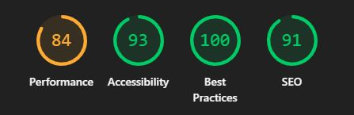

# 
The Mind Garden

| <a href="https://markrshaw99.github.io/The-Mind-Garden/" target="_blank">Live Project</a> |

## Introduction 

The Mind Garden is a web-based mental health awareness project developed as part of the Code Institute Full Stack Software Developer Bootcamp. This project acts as a summary of all I have learned so far during the first 4 weeks of the Bootcamp, with the major focus being on HTML, CSS and Bootstrap. I have aimed to produce a creative exploration of mental well-being, using the rich metaphor of a garden to illustrate both the challenges we face and the growth we can cultivate. In this garden, each element - from the hopeful planting of seeds to the nurturing care of a watering can - symbolises different aspects of our mental wellbeing. 

<h2 align="center" id="TOC">Table of Contents</h2>

* [The Mind Garden](#the-mind-garden)
  - [Introduction](#introduction)
  - [Table of Contents](#TOC)
  - [Project Ouline](#project-outline)
* [Project Planning](#project-planning)
    - [UX Design](#ux-design)
      - [User Stories](#user-stories)
      - [Colors](#colors)
      - [Fonts](#fonts)
      - [Imagery](#imagery)
      - [Wireframes](#wireframes)
* [Features](#features)
  - [General Features](#general-features)
    - [Navigation and Hero Section](#navigation-and-hero-section)
    - [Bootstrap Cards](#bootstrap-cards)
    - [Policies Section](#policies-section)
    - [Footer](#footer)
    - [Links and Buttons](#links-and-buttons)
  - [Responsive Design](#responsive-design)
* [Built With](#built-with)
  - [Technology and Languages](#technologies-and-languages)
  - [Libraries and Frameworks](#libraries-and-frameworks)
  - [Tools & Programs](#tools-and-programs)
* [Development](#deployment)
* [Testing](#testing)
* [Credits](#credits)
  - [Code](#code)
  - [Content Research](#content-research)
  - [Media](#media)
  - [Acknowledgements](#acknowledgements)

<a href="#the-mind-garden">Back To Top</a>

## Project Outline

The Mind Garden is a web-based mental health awareness project developed as part of the Code Institute Full Stack Software Developer Bootcamp. This project is a creative exploration of mental well-being, using the rich metaphor of a garden to illustrate both the challenges we face and the growth we can cultivate. In this garden, each element - from the hopeful planting of seeds to the nurturing care of a watering can—symbolizes different aspects of our mental wellbeing.

Recognizing the sensitivity of mental health topics, I aimed to create a space that is both respectful and relatable. The design intentionally maintains a dignified tone while inviting users to explore and reflect. To achieve this balance, I incorporated playful touches, such as light-hearted cartoon imagery and humurous audio, that add warmth and joy without undermining the serious subject matter.

Through carefully structured sections such as Planting Seeds, the bees and butterflies, Rainclouds and The Watering Can — the page guides users on a journey from acknowledging their challenges to taking proactive steps for self-care. Each metaphor is enhanced by responsive design principles using HTML, CSS, and Bootstrap, ensuring that the experience is accessible and engaging across all devices.

Ultimately, The Mind Garden is more than just a traditional website — it’s an interactive space designed to validate our experiences, inspire reflection, and encourage growth. I invite users to explore its layers, appreciate the playful elements, and find a moment of solace in the collective nurturing of their mental well-being.

### Key Objectives

- Responsive, Interactive Front-End (LO1: Front-End Design & User Experience): • Develop a cohesive one‑page layout using semantic HTML5 and modern CSS/Bootstrap techniques. • Implement a main navigation menu and well‑structured content that adheres to UX principles, ensuring clear headers and intuitive information hierarchy. • Ensure accessibility by meeting colour contrast standards, supplying descriptive alt text for images, and using a mobile‑first approach reinforced by media queries, Flexbox/Grid, and Bootstrap components. (Learning outcomes: LO1.1 and LO1.2)

- Rigorous Code Testing and Validation (LO2: Testing and Validation): • Validate all custom HTML and CSS using W3C and Jigsaw validators to ensure error‑free code. • Apply CSS media queries to deliver a consistent, responsive experience across various screen sizes, ensuring intuitive navigation on the single‑page application. (Learning outcomes: LO2.1 and LO2.2)

- Seamless Cloud Deployment and Version Control (LO3: Cloud Deployment): • Deploy the final version of the project to a cloud‑based hosting platform, ensuring no discrepancies between the development and live versions. • Utilize Git and GitHub for version control, maintain a clear commit history, and remove commented‑out code so that all internal links and interactive elements function as intended. (Learning outcome: LO3.1)

- Comprehensive Documentation for Future Maintainability (LO4: Documentation): • Provide clear documentation and a concise README file that outlines the project’s purpose, user value, key features, and deployment procedure. • Include annotated screenshots, feature descriptions, and proper attribution for any external code or resources to maximize long-term maintainability. (Learning outcome: LO4.1)

- Strategic Use of AI Tools to Enhance Development (LO5: AI-Assisted Development): • Leverage AI tools for generating, debugging, and optimizing code, which not only accelerates the development process but also contributes to improved performance and a better user experience. • Include reflective insights within the README, summarizing how AI influenced key decisions and streamlined workflow—from code creation to code refinement—without overcomplicating the documentation with in‑depth prompt details. (Learning outcomes: LO5.1, LO5.2, LO5.3, and LO5.4)

<a href="#the-mind-garden">Back To Top</a>

## User Stories 

| **Name & Context**| **Quote**| **Design Needs**|
|-|-|-|
| Ravi, 26, University Student | "When I feel anxious, I need something calming and easy to understand, so I can ground myself without reading too much or feeling overwhelmed."| - Visual, image-based navigation - “Grounding Tree” (5-4-3-2-1 technique) - Mood/weather tracker - Simple, non-intrusive layout|
| Ellie, 34, Working Mum| “I don’t have much time to sit and read — I want quick, clear tips that help me recentre, even if I only have two minutes.”| - Expandable “Seedlings of Wisdom” cards - Carousel of support/self-care tips - Watering can feature - Affirmation boxes or “Daily Seed” generator|
| Chris, 42, Tech Professional| “I’m new to the idea of mental wellbeing, but I’d like to explore it in a way that feels thoughtful, not patronising.”| - Metaphor-driven navigation - Informational cards with psychology references - “Tree with Deep Roots” section - Quote-based footer|
| Amina, 29, Artist| “I connect better with visuals than paragraphs. I want something beautiful, intuitive, and metaphor-rich that speaks to emotion.”| - Entire site as garden metaphor - Use of icons and visual metaphors - Subtle interactivity - Custom background as interactive map                             |
| Tom, 51, Recently Bereaved| “Some days are hard. I want a place that acknowledges that without pretending I should just be happy.”| - “Weathering Storms” section - Mood icon tracker - Grounding section - Option for private journaling                                                          |
| Sam, 19, Exploring Mental Health       | “I’ve never really investigated this stuff before, but I want to start. I need it to be simple and not feel medical or formal.”| - Friendly, emoji-accented metaphors - Clear, encouraging tone - “Letting in the Light” section - Gentle animations                                            |
| Jess, 37, Therapist                    | “I’d like a mental wellness site that I can point clients to as a soft starting point, without clinical overtones.”| - Informational but non-medical tone - Garden-style navigational layout - Printable/downloadable resources - Accessible, responsive design                    |
| Kai, 45, Lives with ADHD               | “I struggle with long pages and scattered layouts. I need clear sectioning, minimal distractions, and visual cues.”| - One-page or snap-scrolling design - Consistent colour coding - Emphasis on iconography and short text                                                           |

<a href="#the-mind-garden">Back To Top</a>

## UX Design & Features

The Mind Garden was crafted with a focus on delivering a supportive and engaging experience for users while addressing a sensitive topic with both dignity and a touch of playfulness. My approach centered on careful planning, iterative design thinking, and a commitment to accessible interactivity across all devices.

### Design Principles & Approach

#### Mobile‑First, Responsive Layout: 
The site is built using a mobile‑first philosophy, prioritizing essential content and functionality for smaller devices first, then enhancing the experience on tablets and desktops.

#### Implementation: 
CSS media queries along with Bootstrap’s grid system and Flexbox ensure that every component—from the fixed-top navigation to the scrollable garden image—adapts seamlessly to different screen sizes.

#### Interactive Storytelling Through the Garden Metaphor:
The entire experience is framed as a living garden, with each section symbolizing a different aspect of mental well-being:

#### Interactive Image Map:
Users explore the digital garden by clicking on visible hotspots in the background image, transporting them to different sections like “Sunshine,” “Rainclouds,” “Pesky Weeds,” and “Pots & Plants.”

#### Flipping Seed Cards:
In the Planting Seeds section, seed cards flip on hover or focus using CSS 3D transforms to reveal inspirational quotes, reinforcing the metaphor of nurturing positive thoughts.

#### Dynamic Self-Care Carousel:
The Watering Can section features a Bootstrap carousel showcasing various self‑care tips, offering a refreshing interlude of actionable advice.

#### Accessible and Intuitive Navigation:
Navigation is structured to be clear and effortless, with a fixed-top navbar enhanced by dropdown menus and descriptive anchor links that facilitate seamless movement throughout the garden.

#### Implementation:
The use of semantic HTML elements, proper alt text for images, and thoughtful ARIA attributes helps ensure that all interactive components meet accessibility standards.

#### Playfulness with Purpose: 
While addressing a serious subject, the design incorporates playful elements to create a welcoming atmosphere.

#### Cartoon Imagery & Audio Cues: 
Light-hearted cartoon illustrations and subtle audio feedback (triggered by clicking on elements like the sun or raincloud) add warmth and a hint of humor. These interactive features are designed to be engaging without detracting from the overall respectful tone.

#### Aesthetic Consistency: 
The gentle use of soft backgrounds, refined typography, and carefully balanced color schemes ensures that the visual hierarchy remains clear and the narrative cohesive.

### Planning and Iterative Refinement

During the development phase, I engaged in thorough design planning and concept exploration to determine the best ways to organize content, interactivity, and navigation. This preliminary work guided decisions on layout, interactive elements, and visual styles. Iterative testing helped ensure that the final product delivers a seamless, intuitive experience, with immediate feedback for actions and consistent aesthetics across all devices.
### Outcome and Testing

#### User Engagement: 
The exploration of different interactive components—such as collapsible "Pots & Plants," flip-style seed cards, and the self‑care carousel—has resulted in an engaging narrative that invites users to reflect, act, and connect.

#### Accessibility and Performance: 
The application meets accessibility standards by ensuring high color contrasts, providing alt text, and delivering an intuitive layout that works consistently on mobile and desktop. Regular testing via developer tools and validators confirmed that the site maintains its functionality and visual integrity across various screen sizes.

This UX Design approach allowed The Mind Garden to evolve into an interactive, supportive space that respects and celebrates the complexity of mental well-being. Every design choice - from the responsive layout to the thoughtful interactivity—has been made with the aim of creating an experience that is both engaging and accessible.

<a href="#the-mind-garden">Back To Top</a>

## Colors

Unfinished 

### Main Palette

<a href="#the-mind-garden">Back To Top</a>

## Fonts

As with color, font was a major consideration for ensuring a positive user experience. I felt that 'Lobster' for the headings and 'Segoue UI' for the main body helped to balance that concept of playful but respectful 
TThe fonts were implemented via [Google Fonts](https://fonts.google.com) using a direct import code within head of the HTML file.

<a href="#the-mind-garden">Back To Top</a>

### Wireframes

These low-fidelity wireframes have been created using [Balsamiq](https://balsamiq.com/) to define the key feature layout to guide the user experience design. Utilising the [Bootstrap](https://getbootstrap.com/) framework and available components allows for the construction of a page that feels familiar for ease of navigation whilst also allowing for well structured content and a responsive design. 

**Mobile Wireframe**

Ran out of time

**Tablet Wireframe**

Ran out of time

**Desktop Wireframes**

Ran out of time

<a href="#the-mind-garden">Back To Top</a>

## Imagery

I gave tremendous time and thought into the imagery of the Mind Garden. Countless hours were spent in Photoshop getting everything just right for the site since i considered Imagery to be the foundational principle underpinning my entire site.

<a href="#the-mind-garden">Back To Top</a>

## Features

### General Features

The Mind Garden is designed as an **interactive, one-page experience** that engages users while remaining intuitive and accessible. The site incorporates various features that enhance usability, responsiveness, and interactivity.

#### **Navigation & Hero Section**
- **Resposive Navigation Bar:** A Bootstrap-powered, fixed-top navigation menu that switches to a toggled dropdown on smaller devices ensures easy access to different sections of the page.
- **Dropdown Menus:** Key content areas are neatly grouped into dropdown categories, allowing users to jump between sections smoothly.
- **Welcome Overlay:** A signboard-style introduction greets users, setting the tone before they enter the garden. It allows users to internalise that they are about to enter a seperate part of the internet where they can relax - and the slow 1500ms transition to the homepage forces the user to slow down.
- **Interactive Image Map:** The primary background garden illustration is **clickable** using a HTML image map, letting users navigate by interacting directly with elements like the sun, rainclouds, and trees.

#### **Planting Seeds & Bootstrap Cards**
- **Flipping Seed Cards:** Each seed card flips on hover/focus, revealing positive affirmations that reinforce themes of growth and mindfulness.
- **Custom Seed Packet Background:** Cards feature a whimsical, hand-drawn seed packet image that visually ties into the metaphor of planting thoughts.
- **Expandable Content Blocks:** Various sections—like Pots & Plants—use Bootstrap collapsible cards, allowing users to reveal self-reflections with a click.

#### **Pots & Plants**
- **Interactive Reflection Cards:** Users can open expandable content blocks to reveal thoughtful prompts or self-care moments tied to symbolic plant pots.
- **Section-Specific Styling:** Each pot has a distinct theme, such as gratitude, mindfulness, creativity, and connection.

#### **Sunshine & Audio Cues**
- **Clickable Sun Image:** Users can interact with the **sun illustration**, triggering a **light-hearted audio effect** which is a related uplifting song.
- **Dynamic Background Gradient:** The sunshine section features a smooth CSS-animated **color shift**, reinforcing warmth and positivity.
- **Custom Typography:** A playful heading, styled with Google Fonts, gives this section an uplifting energy.

#### **Bees & Butterflies - Community & Connection**
- **Support Network Concept:** This section symbolizes relationships and mental well-being using three Bootstrap cards:
  - **Active Support** – representing busy, dependable connections.
  - **Gentle Care** – embodying soft, uplifting interactions.
  - **Shared Growth** – reinforcing the power of mutual support.
- **Hover Effects on Cards:** Subtle hover interactions add depth and interactivity.

#### **Weathering the Storm - Rainclouds, Weeds & Watering Can**
- **Rainclouds: Clickable Image & Audio Cue**  
  - Users can click the **raincloud**, triggering an audio track designed to lighten the mood.
  - The section acknowledges emotional heaviness while reinforcing resilience.
- **Pesky Weeds: Thought Patterns & Growth**  
  - A **visual metaphor for intrusive thoughts**, this section encourages users to recognize and challenge negative thinking.
- **Watering Can: Self-Care Strategies Carousel**  
  - A **Bootstrap-powered carousel** cycles through practical self-care techniques.
  - Animated **section transitions** highlight growth and renewal.

### **Responsive Design**
- **Mobile-First Approach:** Layouts are optimized for small screens first, ensuring a seamless experience across all devices.
- **Bootstrap Grid System:** Sections adapt dynamically, whether viewed on a phone, tablet, or desktop.
- **CSS Media Queries:** Refinements at breakpoints ensure intuitive scaling without breaking functionality.

<a href="#the-mind-garden">Back To Top</a>

...

<a href="#the-mind-garden">Back To Top</a>

## Built With

### Technologies and Languages

- HTML
- CSS
- Javascript

### Libraries and Frameworks

### Tools and Programs

- <a href ="https://www.adobe.com/uk/products/photoshop.html
">Photoshop<a/>
- <a href ="https://www.image-map.net/">HTML Image Map Maker<a/>
- <a href ="https://audiotrimmer.com/">Audio Trimmer<a/>
- <a href ="https://emojipedia.org/">Emojipedia<a/>
- <a href ="https://pngtree.com/">PNG Tree<a/>
- <a href ="https://code.visualstudio.com/
">VSCode<a/>

<a href="#the-mind-garden">Back To Top</a>

## Deployment
Setup a repo using Github
 
Once the project repo is created, an early deployment for the live project should performed. 
This allows for early and continuous testing using a variety of devices, as well as the Dev Tools available within browsers.

Additional information on the deployment process can be found on the official [GitHub Docs](https://docs.github.com/en/pages/quickstart)

<a href="#the-mind-garden">Back To Top</a>

## Testing

Testing and validation os the website was carried out throughout the course of the project.

This included regular debugging and testing using the Dev Tools as ptovided within Chrome Browser.

- [HTML Validation](https://validator.w3.org/) 

- [CSS Validation](https://jigsaw.w3.org/css-validator/) 

- [Lighthouse](https://developer.chrome.com/docs/lighthouse/overview) 

<a href="#the-mind-garden">Back To Top</a>

## Future Work & Improvements

Primarily, my main limitation on this project has been time. If I had another day to complete this project, there are a few immediate immprovements I would make:
 - Lighthouse gives immediate feedback into the performance savings that can be made by ensuring all images are compressed and in .webp format
 - I would set images further down the page to loading=lazy to speed up initial loading
 - I would ensure all elements have aria-labels where neccesary to make the site 100% accessible
 - Although not the focus of this project, if i was more proficient in javascript I would add the functionality for the user to add their own content such as seedlings, flowerpots and journal entries using local storage. 

## Credits

### Code

Project and primary learning supplied by [Code Institute](https://codeinstitute.net/ie/) 

### Content Research

...

### Media

- ...

### Acknowledgements

- Thanks to my girlfriend for bug-testing on different platforms and helping to identify flaws and weaknesses.

<a href="#the-mind-garden">Back To Top</a>
